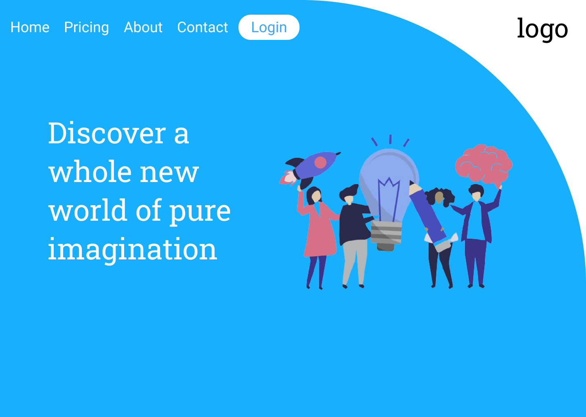

<h1 style="text-align: center;"> 📚 Landing Page Template </h1>

## :star: Iniciando

Simplesmente vá até [o site](https://bruno-slv.github.io/Landing-Page-Template) e veja ele na natureza selvagem.

## :ledger: Seções do site

* **Home** - Homepage
* **Pricing** - Planos diferentes e preços ilustrativos
* **About** - Seção dedicada a falar sobre a "empresa"
* **Contact** - Seção com as um formulário para contato
* **Login** - Redireciona para uma página de login

## :pencil2: Uso 

O uso deste repositório, documentos e design é livre para todos os interessados 
em exercitar as próprias habilidades com CSS, JavaScript e HTML

## 💻 Software usado

Para desenvolver o projeto foram usadas as ferramentas:

* JavasScript
* HTML5
* CSS3
* Visual Studio Code
* Chrome Dev. Tools

## 🤝 Contribuindo

Todos são bem vindos para contribuir com o projeto, bem como ramificar este repositório para uso posterior.

## :page_facing_up: Licença

[MIT](https://opensource.org/licenses/MIT)